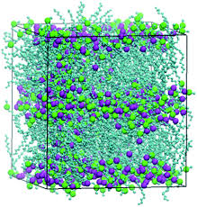
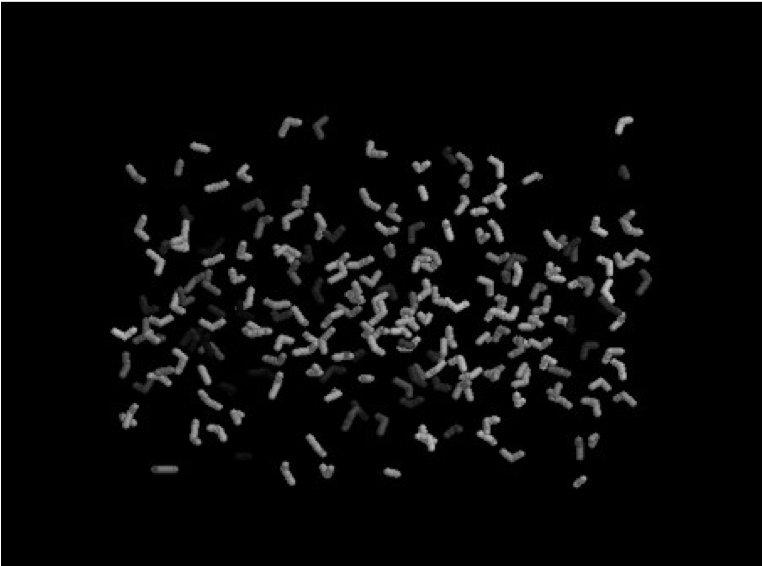

# Water-Methanol-Simulation

-

### WHY STUDY WATER-ALCOHOL MIXTURES

* Water-Alcohol mixtures are widely used in chemical engineering applications such as solvents for gums, resins, lacquers, varnishes and dyes. Modeling and quality control of industrial manufacturing processes require proper characterization of viscosity.

### WHY MOLECULAR DYNAMICS?
* We Can observe how atoms move in space and time. 
* We can determine properties of unknown and known chemicals under extreme conditions of temperature or pressure.

### WHAT is MOLECULAR DYNAMICS?
* Way of determining trajectories of atoms and molecules by numerically solving Newton’s equation of motion for a system of interacting particles where forces between the particles and their potential energies are often calculated using interatomic potentials or molecular mechanics force fields.

-

## PROJECT DETAILS
* Calculated self-diffusion coefficient, density and shear viscosity for a system consisting of 216 molecules of water and 216 molecules of methanol. A box of size 46 × 23 × 23 Å was used and the input file was generated with Avogadro.
* Simulation was performed using OPLS-UA force field for 200 ps using SPC/E model for water.
* The calculation was performed at different temperatures - 273, 283, 288, 293 k - under atmospheric pressure using isothermal-isobaric ensemble (NPT). 

-

## FUTURE WORK
* Study how the mixture interacts under confinement and in porous media
* Simulate water+emulsions

